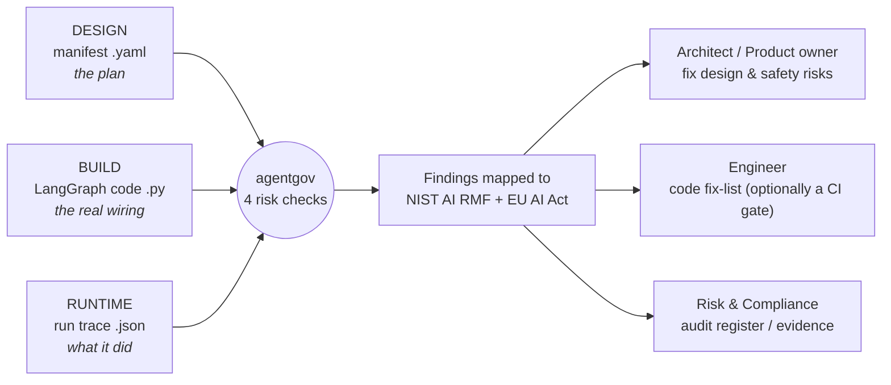

# agentgov

`agentgov` is a static analyzer for LLM agents. It reads how an agent is wired (what tools it
can call, what it can do with them, where a human signs off) and flags the parts that would
fail an AI governance review.

Tools like Inspect and METR test the underlying model. They are not focused on the system you build
on top of it, which is where a lot of the actual risk lives: an agent that can email customers
or move money on its own, a web-search result that feeds straight into a tool call, a loop with
no stop condition. `agentgov` looks at that layer and ties each problem back to the specific
**NIST AI RMF** or **EU AI Act** clause it touches, with a fix.

It can take three kinds of input - a design manifest, the LangGraph source, or a LangSmith run
trace - so you can run the same checks while designing, in CI, and against production logs.

> One of the demo agents was wired to **transfer $25,000 without a human approval step**. It is
> easy to miss in a design review; `agentgov` flags it, names the oversight clause it breaks,
> and points at the line to change.

## Governance across the lifecycle



Each finding lands with **whoever can actually fix it**: a design/architecture risk goes to the
architect or product owner to redesign the safety control, a code-level risk goes to the
engineer (and can block a CI/pre-deploy gate), and every finding is also logged for the risk or
compliance owner as audit evidence.

When the input is **code**, each finding cites the **exact file, line, and function** to change -
so the engineer goes straight to the spot. (Example, run on a public multi-agent repo:
`math_agent (supervisor.py:229), math_tools (supervisor.py:234)` - an unbounded agent/tool loop.)

The three layers are **not redundant** - each catches what the others cannot:

| Stage | You give it | It catches (in the demos) | Like in software |
|---|---|---|---|
| **Design** | `demo/agent.yaml` | a runaway delegation loop in the planned architecture | architecture review |
| **Build** | `demo/agent_graph.py` | untrusted web text wired into the email tool (injection) | code review / CI |
| **Runtime** | `demo/trace_langsmith.json` | a money transfer that actually executed with no approval | QA / UAT / audit logs |
| _(control)_ | `demo/agent_safe.yaml` | nothing - controls applied, clean pass | a passing build |

## Quickstart (uv)

No install - run it straight from the repo with [uv](https://docs.astral.sh/uv/):

```bash
uv run agentgov audit demo/agent.yaml            # DESIGN  -> runaway delegation loop
uv run agentgov audit demo/agent_graph.py        # BUILD   -> injection path in the code
uv run agentgov audit demo/trace_langsmith.json  # RUNTIME -> unapproved money transfer
uv run agentgov audit demo/agent_safe.yaml       # CLEAN   -> nothing (controls applied)

uv run agentgov audit demo/agent.yaml --full     # add --full for the reasoning
uv run agentgov audit demo/agent.yaml -o out.md  # or write the report to a file
```

Input type is auto-detected: `.yaml` = manifest, `.py` = LangGraph code, `.json` = run trace.

### Database mode (optional)

By default the corpus is YAML and the tool runs fully offline. To use the database
backend - Postgres + pgvector for semantic search and Neo4j for the risk graph:

```bash
docker compose up -d                                  # Postgres (pgvector) + Neo4j
uv run --extra db python -m agentgov.ingest           # load the corpus into both
AGENTGOV_BACKEND=db uv run --extra db agentgov audit demo/agent_graph.py

# semantic search over the obligations (free text, no hard-coded rule):
uv run --extra db agentgov match "the agent sends money with no approval"
#  -> top match: EU Art. 14(4) Human oversight -> require explicit human approval
```

## Accuracy

Detection is **taint analysis**, not keyword matching: untrusted input is traced
along the graph to action sinks, and a **sanitiser node stops the taint** - so a
defended path is not flagged. A labelled benchmark (`benchmark/cases.yaml`) guards
this, including deliberate false-positive traps (a sanitised injection path, a
bounded loop):

```bash
uv run python -m agentgov.benchmark
#  TP=4  FP=0  FN=0   precision=1.0  recall=1.0  f1=1.0
```

The benchmark is small and curated; the honest next step is expanding it with
real-world agents to find the cases where precision drops.

## Risks it mitigates today

| Risk (plain English) | What can go wrong | Mapped obligations |
|---|---|---|
| **Unsupervised external action** | the agent sends an email or moves money with no human approval | EU Art. 14(4) human oversight · NIST MANAGE-2.3 |
| **Prompt-injection -> exfiltration** | hidden instructions in web/email content hijack a downstream tool | EU Art. 15 robustness & cybersecurity · NIST MEASURE-2.7 |
| **Unbounded delegation loop** | the agent calls itself in a loop - runaway cost or repeated actions | EU Art. 14(4) stop function · NIST MEASURE-2.6 |
| **Missing oversight** | no audit log or kill-switch - can't stop it or investigate after | EU Art. 12 record-keeping · NIST GOVERN-1.4 |

## Compliance and audit readiness

Every finding is traceable evidence: the exact rule it touches, the node it lives on, and a
proportionate fix. That turns a scan into an **audit record** a risk owner can act on.

- **Frameworks mapped today:** EU AI Act Articles **12, 14, 15**; NIST AI RMF **GOVERN-1.4,
  MEASURE-2.6, MEASURE-2.7, MANAGE-2.3**.
- **Behavioural testing is out of scope on purpose** - it hands off to
  [Inspect](https://inspect.aisi.org.uk) (UK AI Security Institute). `agentgov` audits the
  *structure* of the agent; Inspect tests the *model's behaviour*. Together they cover both.
- **Reasoning lives in data** (`corpus/*.yaml`), so a non-programmer governance reviewer can
  read, check, and extend the mappings without touching code.
- **Policy as code** - the checks and their framework mappings are declarative rules in the
  corpus: versioned, diffable, reviewable, and the same rule set runs across design, code, and
  runtime inputs.

## Where it runs - including as a skill

`agentgov` is a small, dependency-light CLI by design, so it drops into the places agents are
actually built:

- **Locally** - a developer runs it on their agent before committing.
- **In CI / pre-deploy** - a gate that blocks a risky agent from shipping (the design + build
  layers).
- **As a skill inside a coding agent** - so when someone *builds* an agent
  with an AI coding assistant, the assistant can audit it inline and explain the governance
  gaps in plain language. The engine is already a clean CLI, so the skill is a thin wrapper
  over it (next iteration).

## How it works

```
input (.yaml / .py / .json)  ->  loader  ->  detectors  ->  report  ->  Markdown
                                  (seam)     (4 checks)    (corpus)
```

- **`loader.py`** - the single place storage lives. Corpus + input are files today; a
  vector DB, graph DB, or API can replace it with no change to the rest.
- **`detectors.py`** - static, deterministic checks over the agent's nodes/edges/permissions.
  Never runs the target agent.
- **`corpus/*.yaml`** - the governance knowledge: each risk mapped to NIST / EU obligations,
  with the reasoning, severity, context-dependence, and framework gaps held as data.
- **`report.py`** - short table by default; `--full` adds the reasoning behind each finding.

### The agent manifest

A manifest is **data**, never code. It declares the nodes, their permissions, the edges
between them, and the oversight controls:

```yaml
nodes:
  - id: web_search
    consumes_external: true     # ingests untrusted outside content
    external_action: false
  - id: send_email
    external_action: true       # irreversible outbound action
    human_in_loop: false        # no approval gate
edges:
  - { from: web_search, to: send_email }
oversight: { kill_switch: false, audit_log: false }
```

## What it does not cover yet (honest scope)

This is an early, deliberately small tool. Known gaps, on the roadmap:

- **More of the law.** Only 3 EU articles and 4 NIST subcategories are mapped. Missing: EU
  Art. 9 (risk management), Art. 10 (data governance), Art. 13 (transparency), Annex III
  high-risk classification; the full NIST MAP/MEASURE/MANAGE set.
- **Other frameworks.** No ISO/IEC 42001, OWASP LLM Top 10, or MITRE ATLAS mapping yet.
- **Data / PII flows.** No GDPR or PII-to-external-tool checks yet.
- **Dynamic graphs.** The code reader sees structure written literally; a graph built in a
  loop is only partly visible - the runtime trace layer backstops this.
- **Not legal advice.** The corpus is a curated, paraphrased slice of public material; cite
  EUR-Lex / NIST for authoritative text.

## Roadmap

**In place now**
- **Taint-analysis detection** with sanitiser awareness, guarded by a precision/recall benchmark.
- **Controls catalog** - every obligation resolves to a concrete control, action, and reason.
- **Database backend** - Postgres + pgvector (semantic search) and Neo4j (risk -> obligation ->
  control graph), behind the `KnowledgeStore` seam; `AGENTGOV_BACKEND=db` switches to it.
- **`match` command** - semantic search of a free-text risk against the obligations.
- **Runs on real repos** - verified on a public multi-agent LangGraph project.

**Next**
- **Ingest the full frameworks** - the complete NIST / EU / Inspect content, not the curated slice.
- **Grow the benchmark** with real-world agents to find where precision drops.
- **More outputs from one scan** - JSON for CI, and a formal compliance register for auditors.
- **Skill wrapper** - the inline "audit while you build" experience.

## Data sources and licensing

The corpus reuses public material within license:

- **NIST AI RMF 1.0** - [NIST AI 100-1](https://nvlpubs.nist.gov/nistpubs/ai/nist.ai.100-1.pdf),
  [Playbook](https://airc.nist.gov/AI_RMF_Knowledge_Base/Playbook). U.S. Government work, public domain.
- **EU AI Act - Regulation (EU) 2024/1689** - [EUR-Lex](https://eur-lex.europa.eu/eli/reg/2024/1689/oj/eng).
  Reused under the Commission reuse policy (Decision 2011/833/EU); summaries are paraphrased.
- **Inspect (UK AISI)** - [inspect_ai](https://github.com/UKGovernmentBEIS/inspect_ai),
  [inspect_evals](https://github.com/UKGovernmentBEIS/inspect_evals). MIT.

## Tests

```bash
uv run pytest -q
```

## License

MIT - see [LICENSE](LICENSE).
