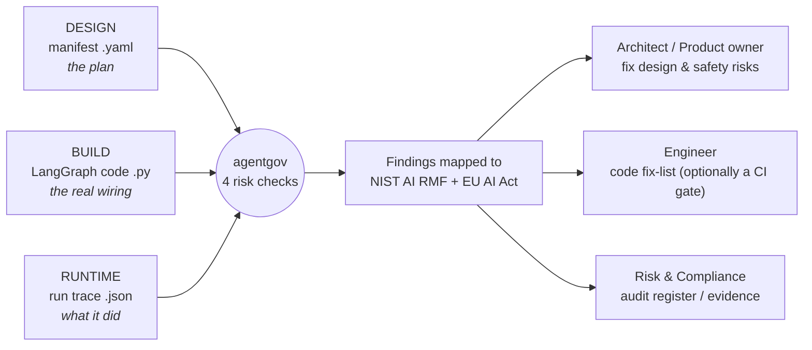

# agentgov

**Governance for AI agents - built into the product lifecycle, not bolted on at the end.**

Model evaluations (Inspect, METR) tell you whether the *model* is safe. They say nothing
about the *agent you built around it* - the tools it can call, the actions it can take, and
whether a human is in the loop. That is where most real-world risk lives, and almost nothing
checks it.

`agentgov` checks it, at **every stage of building an agent** - design, code, and runtime -
and maps each problem it finds to a real obligation in the **NIST AI RMF** and the
**EU AI Act**. One scan, plain-English findings, audit-ready.

> Real example from the demos: an agent quietly wired itself to **transfer $25,000 with no
> human approval**. Design review can miss it. `agentgov` catches it - and tells you which
> oversight rule it breaks and how to fix it.

## Governance across the lifecycle



Each finding lands with **whoever can actually fix it**: a design/architecture risk goes to the
architect or product owner to redesign the safety control, a code-level risk goes to the
engineer (and can block a CI/pre-deploy gate), and every finding is also logged for the risk or
compliance owner as audit evidence.

The three layers are **not redundant** - each catches what the others cannot:

| Stage | You give it | It catches (in the demos) | Like in software |
|---|---|---|---|
| **Design** | `demo/agent.yaml` | a runaway delegation loop in the planned architecture | architecture review |
| **Build** | `demo/agent_graph.py` | untrusted web text wired into the email tool (injection) | code review / CI |
| **Runtime** | `demo/trace_langsmith.json` | a money transfer that actually executed with no approval | QA / UAT / audit logs |
| _(control)_ | `demo/agent_safe.yaml` | nothing - controls applied, clean pass | a passing build |

## Quickstart (uv)

No install - run it straight from the repo with [uv](https://docs.astral.sh/uv/):

```bash
uv run agentgov audit demo/agent.yaml            # DESIGN  -> runaway delegation loop
uv run agentgov audit demo/agent_graph.py        # BUILD   -> injection path in the code
uv run agentgov audit demo/trace_langsmith.json  # RUNTIME -> unapproved money transfer
uv run agentgov audit demo/agent_safe.yaml       # CLEAN   -> nothing (controls applied)

uv run agentgov audit demo/agent.yaml --full     # add --full for the reasoning
uv run agentgov audit demo/agent.yaml -o out.md  # or write the report to a file
```

Input type is auto-detected: `.yaml` = manifest, `.py` = LangGraph code, `.json` = run trace.

## Risks it mitigates today

| Risk (plain English) | What can go wrong | Mapped obligations |
|---|---|---|
| **Unsupervised external action** | the agent sends an email or moves money with no human approval | EU Art. 14(4) human oversight · NIST MANAGE-2.3 |
| **Prompt-injection -> exfiltration** | hidden instructions in web/email content hijack a downstream tool | EU Art. 15 robustness & cybersecurity · NIST MEASURE-2.7 |
| **Unbounded delegation loop** | the agent calls itself in a loop - runaway cost or repeated actions | EU Art. 14(4) stop function · NIST MEASURE-2.6 |
| **Missing oversight** | no audit log or kill-switch - can't stop it or investigate after | EU Art. 12 record-keeping · NIST GOVERN-1.4 |

## Compliance and audit readiness

Every finding is traceable evidence: the exact rule it touches, the node it lives on, and a
proportionate fix. That turns a scan into an **audit record** a risk owner can act on.

- **Frameworks mapped today:** EU AI Act Articles **12, 14, 15**; NIST AI RMF **GOVERN-1.4,
  MEASURE-2.6, MEASURE-2.7, MANAGE-2.3**.
- **Behavioural testing is out of scope on purpose** - it hands off to
  [Inspect](https://inspect.aisi.org.uk) (UK AI Security Institute). `agentgov` audits the
  *structure* of the agent; Inspect tests the *model's behaviour*. Together they cover both.
- **Reasoning lives in data** (`corpus/*.yaml`), so a non-programmer governance reviewer can
  read, check, and extend the mappings without touching code.

## Where it runs - including as a skill

`agentgov` is a small, dependency-light CLI by design, so it drops into the places agents are
actually built:

- **Locally** - a developer runs it on their agent before committing.
- **In CI / pre-deploy** - a gate that blocks a risky agent from shipping (the design + build
  layers).
- **As a skill inside a coding agent** (e.g. Claude Code) - so when someone *builds* an agent
  with an AI coding assistant, the assistant can audit it inline and explain the governance
  gaps in plain language. The engine is already a clean CLI, so the skill is a thin wrapper
  over it (next iteration).

## How it works

```
input (.yaml / .py / .json)  ->  loader  ->  detectors  ->  report  ->  Markdown
                                  (seam)     (4 checks)    (corpus)
```

- **`loader.py`** - the single place storage lives. Corpus + input are files today; a
  vector DB, graph DB, or API can replace it with no change to the rest.
- **`detectors.py`** - static, deterministic checks over the agent's nodes/edges/permissions.
  Never runs the target agent.
- **`corpus/*.yaml`** - the governance knowledge: each risk mapped to NIST / EU obligations,
  with the reasoning, severity, context-dependence, and framework gaps held as data.
- **`report.py`** - short table by default; `--full` adds the reasoning behind each finding.

### The agent manifest

A manifest is **data**, never code. It declares the nodes, their permissions, the edges
between them, and the oversight controls:

```yaml
nodes:
  - id: web_search
    consumes_external: true     # ingests untrusted outside content
    external_action: false
  - id: send_email
    external_action: true       # irreversible outbound action
    human_in_loop: false        # no approval gate
edges:
  - { from: web_search, to: send_email }
oversight: { kill_switch: false, audit_log: false }
```

## What it does not cover yet (honest scope)

This is an early, deliberately small tool. Known gaps, on the roadmap:

- **More of the law.** Only 3 EU articles and 4 NIST subcategories are mapped. Missing: EU
  Art. 9 (risk management), Art. 10 (data governance), Art. 13 (transparency), Annex III
  high-risk classification; the full NIST MAP/MEASURE/MANAGE set.
- **Other frameworks.** No ISO/IEC 42001, OWASP LLM Top 10, or MITRE ATLAS mapping yet.
- **Data / PII flows.** No GDPR or PII-to-external-tool checks yet.
- **Dynamic graphs.** The code reader sees structure written literally; a graph built in a
  loop is only partly visible - the runtime trace layer backstops this.
- **Not legal advice.** The corpus is a curated, paraphrased slice of public material; cite
  EUR-Lex / NIST for authoritative text.

## Roadmap (next iteration)

- **Corpus into a database** - Postgres + pgvector for semantic search over clause text, and
  a graph DB for the relationships between risks, controls, and obligations (the `loader.py`
  seam already isolates this).
- **More outputs from one scan** - JSON for CI and dashboards, and a formal compliance
  register (obligations, status, evidence) for auditors.
- **Run on real projects** - real LangGraph codebases and real LangSmith traces, not just demos.
- **Skill wrapper** - the inline "audit while you build" experience.

## Data sources and licensing

The corpus reuses public material within license:

- **NIST AI RMF 1.0** - [NIST AI 100-1](https://nvlpubs.nist.gov/nistpubs/ai/nist.ai.100-1.pdf),
  [Playbook](https://airc.nist.gov/AI_RMF_Knowledge_Base/Playbook). U.S. Government work, public domain.
- **EU AI Act - Regulation (EU) 2024/1689** - [EUR-Lex](https://eur-lex.europa.eu/eli/reg/2024/1689/oj/eng).
  Reused under the Commission reuse policy (Decision 2011/833/EU); summaries are paraphrased.
- **Inspect (UK AISI)** - [inspect_ai](https://github.com/UKGovernmentBEIS/inspect_ai),
  [inspect_evals](https://github.com/UKGovernmentBEIS/inspect_evals). MIT.

## Tests

```bash
uv run pytest -q
```

## License

MIT - see [LICENSE](LICENSE).
